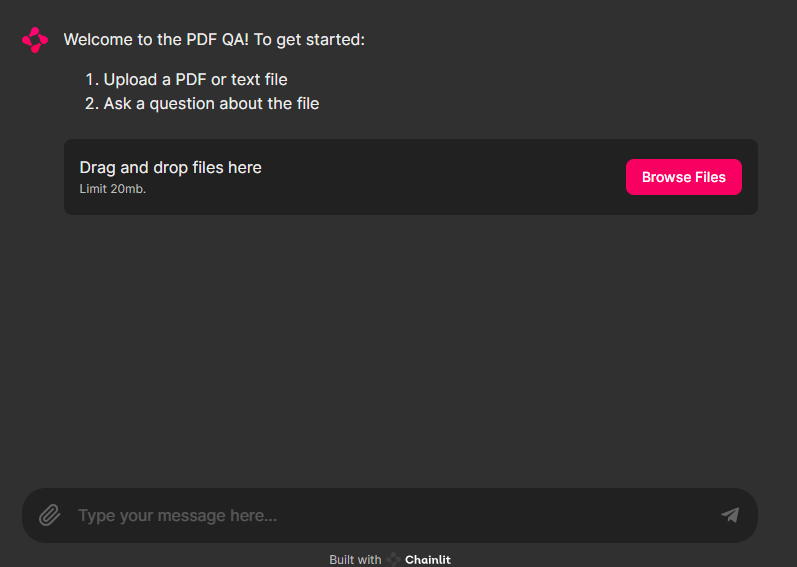
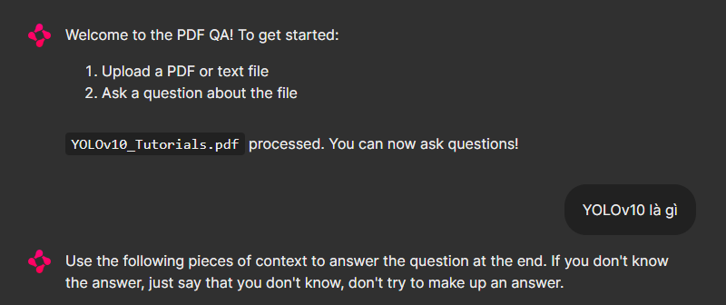
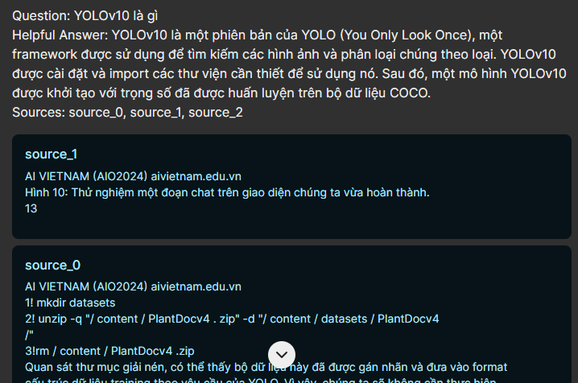
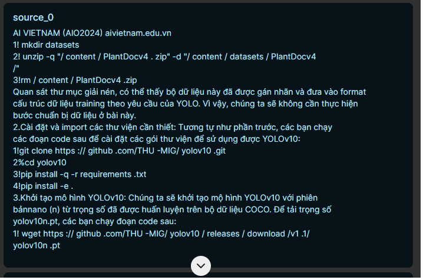
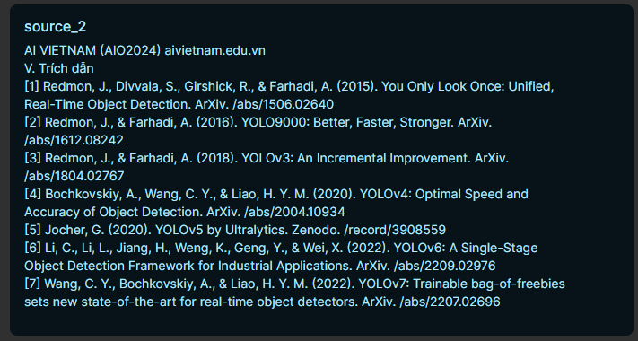

# RAG with Chainlit for PDF QA

## Table of Contents
1. [Introduction](#introduction)
2. [Running the Application](#running-the-application)
3. [Explanation of Code Cells](#explanation-of-code-cells)
4. [Using the Application](#using-the-application)
5. [Product Demo](#product-demo)
6. [Acknowledgements](#acknowledgments)

## Introduction

This project demonstrates a Retrieval-Augmented Generation (RAG) system built for answering questions about PDF documents. It leverages Chainlit to create a user-friendly web application where users can upload PDFs and ask questions directly within a chat interface. The application retrieves relevant information from the uploaded document and utilizes a powerful language model to generate informative answers.

**Important Note for Running the Colab Notebook:**

This project requires a GPU to function properly. When opening the Colab notebook, be sure to select "Runtime" -> "Change runtime type" and choose a GPU runtime option.

## Running the Application:

1. **Access the Colab Notebook:** Open the following link in your web browser: [[TGH] RAG_Langchain_Project_V2](https://colab.research.google.com/drive/1lNhhk5paglaivOQ-IAShkBynYkGkZlKN#scrollTo=kjQzxAYT4ZFh)

2. **Run the Cells:**

   a. **Enable Colab Runtime Execution:** Click the "Runtime" menu in the top toolbar and select "Run all cells".

   b. **Observe the Output:** The notebook will execute the code cells, and the application will launch automatically.

## Explanation of Code Cells:

**Cell 1:** This cell lists the Python libraries needed to run the application.

1. Purpose: To install the required dependencies for the project.

2. Significance: Ensures that users have the necessary libraries to run the code without encountering installation errors.

**Cell 2:** This cell contains the source code for the Chainlit application, defined in the `app.py` file.

1. Purpose: To define the Chainlit application's functionality, including user interface elements, event handling, and logic for processing uploaded files, generating responses, and interacting with the RAG model.

2. Significance: This cell is the core of the application, enabling users to upload files, ask questions, and receive answers.

**Cell 3:** This cell likely contains code for configuring and starting the ngrok tunnel.

1. Purpose: To create a secure tunnel that allows users to access the locally running Chainlit application from their web browsers.

2. Significance: Enables remote access to the application without requiring users to install or configure anything on their own machines.

**Cell 4:** This cell runs the Chainlit application using the `chainlit run app.py` command.

1. Purpose: To launch the Chainlit application within the Colab notebook environment.

3. Significance: Initiates the interactive user interface and starts serving the application.

**Notes**:
- _Cell 3 - ngrok Authentication Token_: Replace `2ipkWlfoUMwqOkYuSxB7PLjHkBj_6vidSqzTVg8mFzHJs3rTA` with your own ngrok authentication token (go to [https://ngrok.com/](https://ngrok.com/)).

- _Access the Application_: After running cell 4, copy and paste the public URL displayed in the cell 3's output into your web browser to access the Chainlit application.

## Using the Application:

1. **Upload a PDF or text file:** Click the upload button and select your file.
2. **Ask a question:** Once the file is processed, type your question about the uploaded content in the chat interface.
3. **Get the answer:** The application will use the RAG model to retrieve relevant information from the document and generate a response to your question.

## Product Demo:

**Step 1: Upload a PDF File**

1. Once you have launched the Chainlit application, the interface will appear as shown in the image below.

  

2. Click on the "Choose File" button to upload the PDF file you want to use.

3. Select the PDF file from your computer and click on the "Open" button.

4. The PDF file will be uploaded to the application, and you will see a confirmation message.

**Step 2: Ask a Question**

1. After the PDF file has been successfully uploaded, you can start asking questions to the chatbot related to the content of the file.

2. Type your question into the chat box at the bottom of the screen.

3. Press Enter or click on the "Send" button to submit your question.

  

**Step 3: Check the Chatbot's Response**

1. The chatbot will process your question and respond within a few seconds.

2. The response will be displayed in the chat box below your question.

3. You can continue to ask additional questions or request the chatbot to elaborate on its response.

  

  

  

<!-- **Example Images:**

* **Image 1:** Chainlit application interface
* **Image 2:** Chat box and "Send" button
* **Image 3:** Example of a question
* **Image 4:** Example of a response
* **Image 5:** Example of a request for further explanation -->

## Acknowledgments

The development of this product was made possible through the contributions of several valuable resources and technologies:

* **Vicuna-7b-v1.5:** This remarkable chatbot, trained by fine-tuning LLaMA on user-shared conversations from ShareGPT, surpasses OpenAI ChatGPT and Google Bard in dialogue tasks, achieving over 90% quality.

* **Langchain:** This open-source language understanding framework played a crucial role in enabling the chatbot to process and interpret the nuances of human language. 

* **Chainlit:** This innovative application provided the platform upon which the chatbot's functionalities were integrated. 
